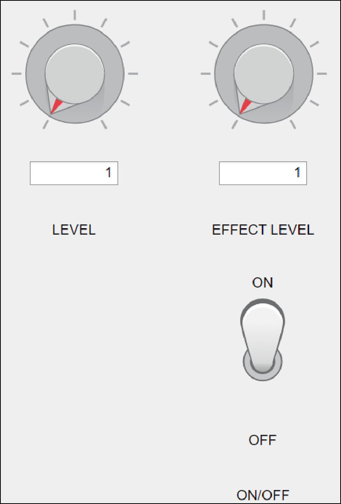

# CochlearDelayFilter
An all-pass filter simulating cochlear delay characteristics.

## Installation
1. Download the file `CochlearDelayFilter.dll` from this repository.
2. Place the file in your DAW's VST plugin folder (e.g., `C:\Program Files\VSTPlugins` on Windows).
3. Restart your DAW and load the plugin.

## GUI Overview

    

## Parameter Descriptions
Below are the details about the roles and usage of each knob.

### 1. **Level**
- **Role**: Adjusts the volume of the processed audio signal.
- **Range**: 0% ～ 100%
- **Description**: This knob allows you to increase or decrease the volume of the filtered signal.

### 2. **Effect Level**
- **Role**: Adjusts the delay amount of the cochlear delay filter.
- **Range**: 1/100 ～ 5 times the cochlear delay
- **Description**: 
  - This knob is used to finely tune the delay characteristics.
  - The delay amount can be adjusted in increments of 1/100, allowing users to modify the original cochlear delay characteristics up to 5 times.
  - Smaller values provide subtle delay effects, while larger values offer pronounced delay effects.

### 3. **ON/OFF**
- **Role**: Toggles the filter on or off.
- **Description**:
  - When set to **ON**, the filter is enabled.
  - When set to **OFF**, the filter is bypassed, and the original signal is output without processing.
  - This is useful for instantly comparing the filtered and original signals during experiments or music production.
